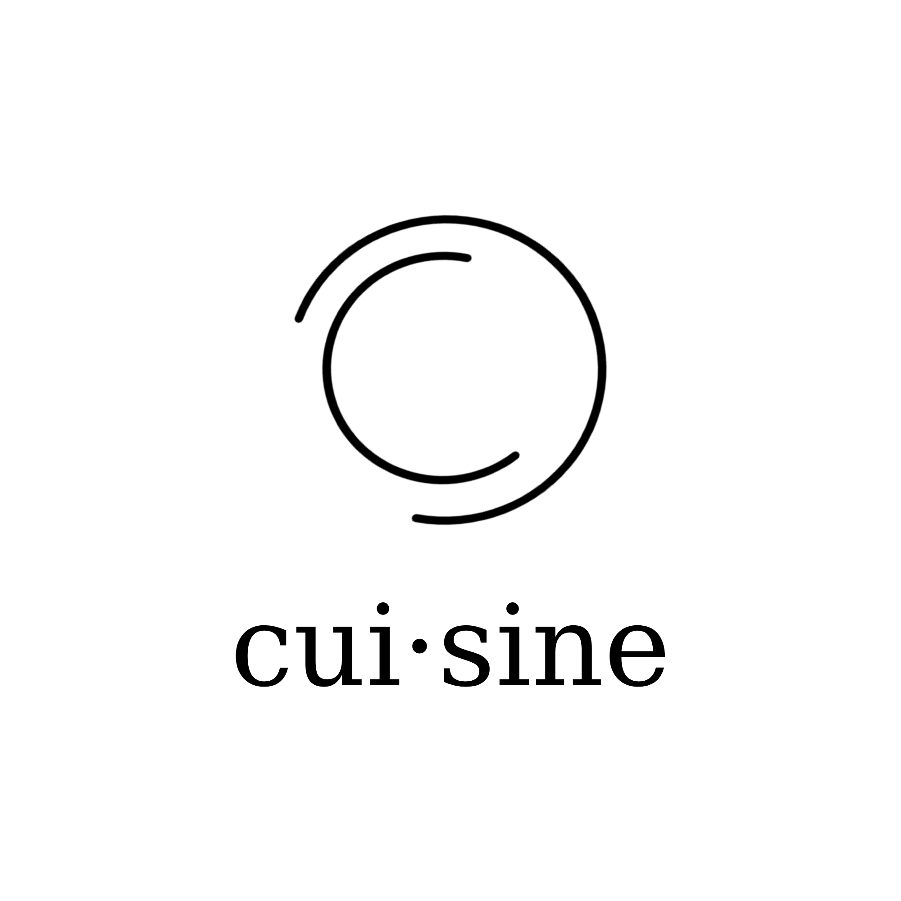
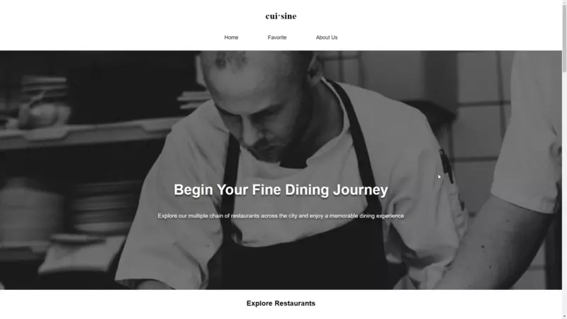

# cui-sine

<div style="text-align: center;">
    
</div>

Explore multiple chain of restaurants across the city.

This project is a part of Dicoding Front-End Web Developer Expert final submission.

The web application demonstrates the use of:
1. Mobile First Approach
2. Accesibility
3. Javascript Clean Code
4. Progressive Web App
5. Automation Testing (Karma + Codecept)
6. Web Performance (web Vitas and optimizations)

Check out the live demo: https://ashy-pond-0561d6800.azurestaticapps.net/


## Showcase



## Usage

Running locally
```
npm install
npm run build
npm run build-image
npm run start-dev
```

Integration testing
```
npm run test
```

End to end testing
```
npm run e2e
```
